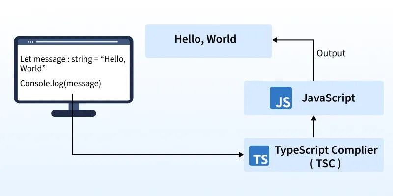
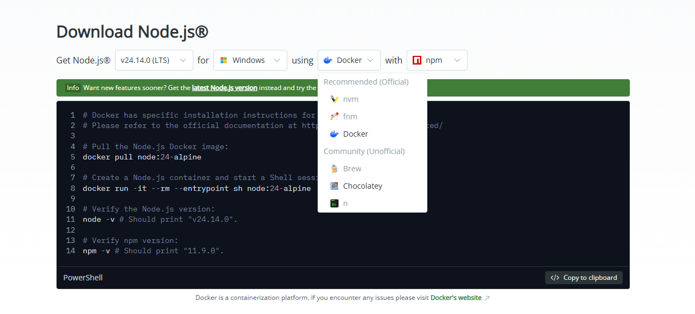
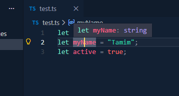

<h1 align="center">TypeScript Notes</h1>

- [TypeScript Introduction:](#typescript-introduction)
  - [What is TypeScript:](#what-is-typescript)
  - [TypeScript Main Features:](#typescript-main-features)
  - [JavaScript Vs TypeScript](#javascript-vs-typescript)
  - [How to run TypeScript:](#how-to-run-typescript)
  - [Inference vs Explicit Typing (Type Annotation):](#inference-vs-explicit-typing-type-annotation)
    - [1. Inference:](#1-inference)
    - [2. Explicit Typing (Type Annotation):](#2-explicit-typing-type-annotation)
    - [When to use what:](#when-to-use-what)
- [Number, Boolean, String:](#number-boolean-string)
- [Any, Unknown, Never, undefined \& null](#any-unknown-never-undefined--null)
  - [any](#any)
  - [unknown](#unknown)
  - [Never:](#never)
  - [Undefined:](#undefined)
  - [Null:](#null)
- [Literal, as const and readonly:](#literal-as-const-and-readonly)
  - [Literal:](#literal)
  - [readonly:](#readonly)
  - [as const:](#as-const)
- [union:](#union)
- [enum:](#enum)
- [Array and Tuple:](#array-and-tuple)
  - [Array:](#array)
  - [Tuple:](#tuple)
- [object:](#object)


# TypeScript Introduction:

## What is TypeScript:

TypeScript is a superset of JavaScript that design to make large-scale application development safer, more predictable, and easier to maintain. It is a compiled language, meaning TypeScript code first converted into JavaScript before execution.



Note: Superset means a language that includes all features of another language, plus add additional features.

## TypeScript Main Features: 
- Static Typing: Allows us to define types.
- Static Type Checking: TypeScript detects type errors while writing code (during development) and at compile time, before the code runs.
- Code Suggestions & IntelliSense:

## JavaScript Vs TypeScript

| JavaScript                                                   | TypeScript                                                                               |
| ------------------------------------------------------------ | ---------------------------------------------------------------------------------------- |
| A scripted programming language                              | A compiled language that is superset of JS                                               |
| Runs directly in browsers or Node.js (no compilation needed) | Must be compiled to JavaScript using the TypeScript compiler (tsc)                       |
| Errors appear only at runtime                                | Errors while writing code (during development) and at compile time, before the code runs |
| Prototype based OOP                                          | Class-based OOP syntax (compiles to JS prototypes)                                       |
| Basic editor support, limited IntelliSense.                  | Rich editor support, full IntelliSense with type information                             |

## How to run TypeScript:

- Step 1: Install Node.js for windows/linux/mac using NVM with NPM:



- Step 2: Install TypeScript:

  - Option 1: Global install (Good for learning raw TS)

```bash
npm install -g typescript
```

By using the -g flag, we install TypeScript globally on our computer. But when we build real projects, we should install TypeScript as a dev dependency, so it only works inside that project.

  - Option 2: Project-based install (Recommended for real projects)

```bash
npm install typescript --save-dev
```
Now TypeScript is installed only inside that project. To use the compiler:

```bash
npx tsc index.ts
```

- step 3: First program: 

```ts
const str: string = 'Hello World'
console.log(str)
```

Now How to See the Output?

  - Option 1: Using Node.js directly (Node 22.6.0+)

```bash
node index.ts
```

Output: 
```
Hello World
```

We might wondered that how node understand ts code? 

Starting from Node.js v22.6.0, Node introduced Type Stripping. Type Stripping means:
- Node removes typeScript from the file
- Then executes the remaining JavaScript
So Node is NOT running TypeScript directly. It removes the types first, then runs JavaScript behind the scenes.

Note: Still Node.js won't fully support TS, It only can remove basic type annotations. So when we do `node index.ts` advance TS features like enum, namespace etc  might not works. For that case we need to manually compiled the ts code by using TypeScript Compiler `tsc` so se the output of our code in raw js. 

  - Option 2: Using TypeScript Compiler (TSC)
Compile the file manually using TypeScript Compiler:

```bash
tsc index.ts
```

Now we can see a new index.js file create, se basically TSC convert you index.ts to index.js:

```js
// index.js
var str = 'Hello World';
console.log(str);
```
so, now our code runner extension on vs code works, or you can see output manually by using `node index.js`: 

```
Hello World
```

  - Option 3: Using ts-node (Development shortcut): 

Install `ts-node` along with ts: 

```bash
npm install typescript ts-node --save-dev
```

Then run: 

```bash
npx ts-node index.ts
```

This compiles the TypeScript in memory and runs the output instantly. Basically Behind the scenes it do:

```
TypeScript → JavaScript → Node execution
```

## Inference vs Explicit Typing (Type Annotation): 
In TypeScript there are two main ways types are handled: 

### 1. Inference:

Type inference is when TypeScript guess and assigns a type automatically based on the value or context.

```ts
let age = 20; // let age: number
let myName = "Tamim"; // let name: string
let active = true;  // let active: boolean


```


```ts
const user = {
    name: "Alice", // (property) name: string
    age: 30, // (property) age: number
    isAdmin: true // (property) isAdmin: boolean
};
```

```ts
const id = 2; // const id: 2
```
here, id types is set to 2, Because const data types are immutable.

### 2. Explicit Typing (Type Annotation): 
Explicit typing is when we assigns the type ourself. Means here, we manually define the type.

```ts
let age: number = 20;
let name: string = "Tamim";
let isAdmin: boolean = false;
```

### When to use what: 
- Use inference for small, local variables.
- Use explicit typing for important or shared code.

# Number, Boolean, String:

```ts
let age: number = 25;
let price: number = 99.99;

let isLoggedIn: boolean = true;
let hasPaid: boolean = false;

let username: string = "Tamim";
let greeting: string = `Hello, ${username}!`;
```

# Any, Unknown, Never, undefined & null

## any
any disables TypeScript’s type checking for that specific variable. It allows us to assign any value and perform any operation without compile-time errors.

```ts
let something: any;

something = 42;         // number
something = "Hello";    // string
something = true;       // boolean
something = [1, 2, 3]; // array
```

Since, any bypasses type safety, TypeScript will not prevent invalid operations:

```ts
something.nonExistentMethod(); // No error at compile time (unsafe)
```

Note: It is strongly recommended to avoid any in production code because it removes all static type guarantees and can introduce hidden runtime bugs.

## unknown
unknown is similar to any, but type-safe. We can assign any value to an unknown variable, but cannot perform operations on it until narrow its type using type guards such as typeof, instanceof, Array.isArray(), or custom type guards.

```ts
let value: unknown;

value = "Hello";   // string
value = true;      // boolean
value = 10.23435;  // number

// console.log(value.toFixed(2)); 
// Error: Object is of type 'unknown'.
```

we must check the type before using it:

```ts
console.log(typeof value === "number" && value.toFixed(2)); // 10.23
```

Note: A type guard is a runtime check that narrows a variable’s type within a specific scope so TypeScript can safely infer a more specific type.

## Never: 
never represents a value that can never exist. It is used for functions that never return or for logically unreachable code paths.

```ts
function throwError(message: string): never {
  throw new Error(message);
}
```

```ts
function infiniteLoop(): never {
  while (true) {}
}
```

## Undefined: 
undefined means a variable has been declared but not assigned a value.

```ts
let notAssigned: undefined = undefined;
console.log(notAssigned); // undefined
```

Note: In JavaScript, variables are undefined by default if not initialized. In TypeScript, you must explicitly include undefined in the type if a value may be missing.

## Null: 
null represents an intentional absence of a value. It is typically used when you explicitly want to indicate that something is empty or not set.

```ts
let selectedUser: string | null = null;

selectedUser = "Tamim";
selectedUser = null;
```

#  Literal, as const and readonly:

## Literal: 
Represents an exact value that a variable can hold. Means it's not represent a data type as a type, its represents an exact value as a type.

```ts
let direction: 'left';

// direction = 'right'; // Type '"right"' is not assignable to type '"left"'.

direction = 'left'
```

Literal types are commonly combined with unions:

```ts
let move: 'left' | 'right';

move = 'left';
move = 'right';
// move = 'up';  // Type '"up"' is not assignable to type '"left" | "right"'.
```

## readonly:
readonly prevents a object property or array element being reassigned after initialization.  

Note; unlike literal, its represent a data types as a type. so it just prevent us to modify a value after initialization.


```ts
const user: { readonly id: string, name: string } = {
    id: "123", // (property) id: string
    name: "Tamim" // (property) name: string
};

// user.id = "456";  // Cannot assign to 'id' because it is a read-only property.

user.name = "Alex";
```

```ts
const numbers: readonly number[] = [1, 2, 3];

// numbers.push(4); 
// Property 'push' does not exist on type 'readonly number[]'.
```

Note: readonly is a shallow restriction. It does NOT deeply freeze nested objects or arrays.


## as const:
Automatically converts a value to its most specific literal type and makes it deeply readonly. so, its combine literal type and readonly at a time. Means it represents a value as a type (literal) +  prevent us to modify a value after initialization (readonly).


```ts
const directions = ["left", "right", "up", "down"] as const; // const directions: readonly ["left", "right", "up", "down"]

// directions.push("forward"); // Property 'push' does not exist on type 'readonly ["left", "right", "up", "down"]'.
```


```ts
const person = {
    name: "Tamim",
    age: 20
} as const;

/*
const person: {
    readonly name: "Tamim";
    readonly age: 20;
}
*/

// person.name = "Alex"; // Cannot assign to 'name' because it is a read-only property.
```

# union: 
Combine multiple literal types or general types into one variable. It is written using the pipe (|) symbol.

- literal union: 

```ts
let direction: "left" | "right"; 
direction = "left";
direction = "right"
// direction = "UP" // Type '"UP"' is not assignable to type '"left" | "right"'.
```
```ts
let dice: 1 | 2 | 3 | 4 | 5 | 6; // literal union

dice = 3;
dice = 6;
dice = 7; // Type '7' is not assignable to type '1 | 2 | 3 | 4 | 5 | 6'.
```

- general union:

```ts
let id: number | string; 

id = 234
id = 'id123'
// id = true // Type 'boolean' is not assignable to type 'string | number'.
```

# enum: 
Enum is a collection of named constants grouped under a single type, which can have numeric (default) or string values.

```ts
enum Days {
    saturday, // 0
    sunday, // 1
    monday // 2
}

let dayName: Days = Days.saturday
console.log(dayName) // 0

// Note: If you don’t assign values, TypeScript gives automatic numeric values starting from 0.
```

```ts
enum Direction {
    Left = "left",
    Right = "right",
    Up = "up",
    Down = "down"
}

let move: Direction = Direction.Left;
console.log(move) // left
```

# Array and Tuple: 

## Array: 

```ts
let numbers: number[] = [1, 2, 3]
let characters: string[] = ['a', 'b']

let mix: (string | number)[] = [1, "Hello", 2, 4, 'hi'] // union array
```

## Tuple:
Tuples are fixed-length arrays with fixed types for each element.

```ts
let user1: [string, number] = ['tamim', 20]
let user2: [number, number] = [20, 20]

// tuple with optional element
let user3: [string, number?];

user3 = ["Tamim"];      
user3 = ["Tamim", 20];  
```

# object: 

```ts
let person: {
    name: string;
    age: number;
    isAdmin: boolean
} = {
    name: "Tamim",
    age: 20,
    isAdmin: true
}

// Optional Properties

let user: {
    name: string,
    age?: number
} = {
    name: "Tamim"
}

console.log(person)
console.log(user)

// Readonly Properties
let admin: {
    readonly id: number;
    name: string;
} = {
    id: 1,
    name: "Tamim"
};

admin.id = 2; // Cannot assign to 'id' because it is a read-only property.

// as const
let userConst = {
    name: "Tamim",
    age: 20
} as const;

userConst.name = "Muhamamd" // Cannot assign to 'name' because it is a read-only property.
```

