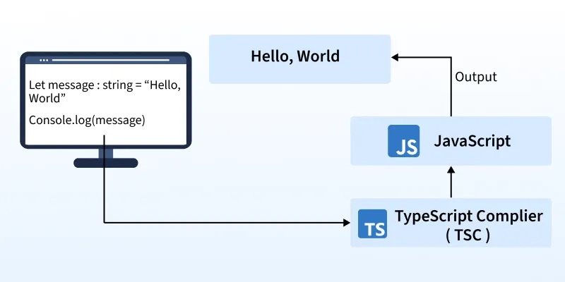
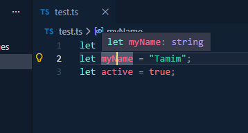

<h1 align="center">TypeScript Notes</h1>

- [1. Setup:](#1-setup)
- [2. TypeScript Introduction:](#2-typescript-introduction)
  - [2.1. What is TypeScript:](#21-what-is-typescript)
  - [2.2. TypeScript Main Features:](#22-typescript-main-features)
  - [2.3. JavaScript Vs TypeScript](#23-javascript-vs-typescript)
  - [2.4. Inference vs Explicit Typing (Type Annotation):](#24-inference-vs-explicit-typing-type-annotation)
    - [2.4.1. Inference:](#241-inference)
    - [2.4.2. Explicit Typing (Type Annotation):](#242-explicit-typing-type-annotation)
    - [2.4.3. When to use what:](#243-when-to-use-what)
- [3. Number, Boolean, String:](#3-number-boolean-string)
- [4. Any, Unknown, Undefined, Null \& Never,](#4-any-unknown-undefined-null--never)
- [5. Literal, readonly and as const:](#5-literal-readonly-and-as-const)
- [6. union:](#6-union)
- [7. enum:](#7-enum)
- [8. Array and Tuple:](#8-array-and-tuple)
- [9. Function:](#9-function)
- [10. Object:](#10-object)
- [11. Type Alias and Interface:](#11-type-alias-and-interface)
- [12. intersection:](#12-intersection)
- [13. Type Assertion:](#13-type-assertion)
- [14. Generics](#14-generics)
    - [14.0.1. Constrain](#1401-constrain)
    - [14.0.2. keyof:](#1402-keyof)
- [15. Type Guards](#15-type-guards)
    - [15.0.1. Typeof:](#1501-typeof)
    - [15.0.2. in Operator:](#1502-in-operator)
    - [15.0.3. Instanceof:](#1503-instanceof)
    - [15.0.4. Equality Narrowing:](#1504-equality-narrowing)
    - [15.0.5. Truthiness Narrowing:](#1505-truthiness-narrowing)
    - [15.0.6. Array.isArray():](#1506-arrayisarray)
- [16. Utility Types:](#16-utility-types)
- [17. OOP:](#17-oop)
    - [17.0.1. Classes:](#1701-classes)
    - [17.0.2. Static Keyword:](#1702-static-keyword)
    - [17.0.3. The Four Pillars of OOP:](#1703-the-four-pillars-of-oop)
      - [17.0.3.1. Encapsulation:](#17031-encapsulation)
      - [17.0.3.2. Abstraction:](#17032-abstraction)
        - [17.0.3.2.1. Difference Between Encapsulation and Abstraction:](#170321-difference-between-encapsulation-and-abstraction)
      - [17.0.3.3. Inheritance:](#17033-inheritance)
      - [17.0.3.4. Polymorphism:](#17034-polymorphism)
        - [17.0.3.4.1. Using Methods Overriding:](#170341-using-methods-overriding)
        - [17.0.3.4.2. Using Duck Typing:](#170342-using-duck-typing)

# 1. Setup:

- Step 1: Install Node.js:
 

- Step 2: Install TypeScript:

  - Option 1: Global install (Good for learning raw TS)

```bash
npm install -g typescript
```

By using the -g flag, we install TypeScript globally on our computer. But when we build real projects, we should install TypeScript as a dev dependency, so it only works inside that project.

  - Option 2: Project-based install (Recommended for real projects)

```bash
npm install -D typescript
```
Now TypeScript is installed only inside that project.


- step 3: First program: 

```ts
// index.ts
const str: string = 'Hello World'
console.log(str)
```

- step 4: How to See Output:

  - Option 1: Using Node.js directly (Node 22.6.0+)

```bash
node index.ts
```

Output: 
```
Hello World
```

We might wondered that how node understand ts code? 

Starting from Node.js v22.6.0, Node introduced Type Stripping. Type Stripping means:
- Node removes typeScript from the file
- Then executes the remaining JavaScript

So Node is NOT running TypeScript directly. It removes the types first, then runs JavaScript behind the scenes. But remember It only can remove basic type annotations. So advance TS features like enum, namespace etc  might not works. For that case we need to manually compiled the ts code by using TypeScript Compiler `tsc` to convert ts to js. 

  - Option 2: Using TypeScript Compiler (TSC)
Compile the file manually using TypeScript Compiler:

```bash
// if we used npm install -g typescript
tsc index.ts
```

```bash
// if we used npm install -D typescript
npx tsc index.ts
```
Now we can see a new index.js file create, se basically TSC convert you index.ts to index.js:

```js
// index.js
var str = 'Hello World';
console.log(str);
```
so, now our code runner extension on vs code works, or we can see output manually by using:

```bash
node index.js`: 
```

  - Option 3: Using ts-node (Development shortcut): 

Install `ts-node` along with ts: 

```bash
npm install -D typescript ts-node
```

Then run: 

```bash
npx ts-node index.ts
```

This compiles the TypeScript in memory and runs the output instantly. Basically Behind the scenes it do:

```
TypeScript → JavaScript → Node execution
```

# 2. TypeScript Introduction:

## 2.1. What is TypeScript:

TypeScript is a superset of JavaScript that design to make large-scale application development safer, more predictable, and easier to maintain. It is a compiled language, meaning TypeScript code first converted into JavaScript before execution.

**Note:** Superset means a language that includes all features of another language, plus add additional features.




## 2.2. TypeScript Main Features: 
- Allows us to define types.
- Detects type errors while writing code (during development at vs code) and at compile time.
- Code Suggestions & IntelliSense:

## 2.3. JavaScript Vs TypeScript

| JavaScript                                                   | TypeScript                                                                           |
| ------------------------------------------------------------ | ------------------------------------------------------------------------------------ |
| A scripted programming language                              | A compiled language that is superset of JS                                           |
| Runs directly in browsers or Node.js (no compilation needed) | Must be compiled to JavaScript using the TypeScript compiler (tsc)                   |
| Errors appear only at runtime                                | Errors appear while writing code (during development at vs code) and at compile time |
| Basic editor support, limited IntelliSense.                  | Rich editor support, full IntelliSense with type information                         |

**Note:** Runtime means when the code is actually executing in the browser or Node.js. Errors that occur at this stage are called runtime errors. If they are not handled properly, they can crash the application,

## 2.4. Inference vs Explicit Typing (Type Annotation): 
In TypeScript there are two main ways to handle types: 

### 2.4.1. Inference:

Type inference is when TypeScript guess and assigns a type automatically based on the value or context.

```ts
let age = 20; // let age: number
let myName = "Tamim"; // let name: string
let active = true;  // let active: boolean


```


```ts
const user = {
    name: "Alice", // (property) name: string
    age: 30, // (property) age: number
    isAdmin: true // (property) isAdmin: boolean
};
```

```ts
const id = 2; // const id: 2
```
**Note:** here, id types is set to 2, Because const data types are immutable.

### 2.4.2. Explicit Typing (Type Annotation): 
Explicit typing is when we assigns the type ourself. Means here, we manually define the type.

```ts
let age: number = 20;
let name: string = "Tamim";
let isAdmin: boolean = false;
```

### 2.4.3. When to use what: 
- Use inference for small, local variables.
- Use explicit typing for important or shared code.

# 3. Number, Boolean, String:

```ts
let age: number = 25;
let price: number = 99.99;

let isLoggedIn: boolean = true;
let hasPaid: boolean = false;

let username: string = "Tamim";
let greeting: string = `Hello, ${username}!`;
```

# 4. Any, Unknown, Undefined, Null & Never,

- **any**: Disables TypeScript’s type checking for that specific variable. It allows us to assign any value and perform any operation without development (vs code level) and compile-time errors.

```ts
let something: any;

something = 42;         // number
something = "Hello";    // string
something = true;       // boolean
something = [1, 2, 3]; // array
```

```ts
let something

something = 42;         // number
something = "Hello";    // string
something = true;       // boolean
something = [1, 2, 3]; // array
```

**Note:** if a variable are empty ts by default infer it to any type, so we can assign any value to it.

Since, any bypasses type safety, TypeScript will not prevent invalid operations:

```ts
something.nonExistentMethod(); // No error at compile time (unsafe)
```

**Note:** It is strongly recommended to avoid any in production code because it removes all type checking by ts and can introduce hidden runtime bugs.

- **unknown**: Similar to any, but type-safe. We can assign any value to an unknown variable, but cannot perform operations on it until narrow its type using type guards such as typeof, instanceof, Array.isArray(), or custom type guards.

```ts
let value: unknown;

value = "Hello";   // string
value = true;      // boolean
value = 10.23435;  // number

// console.log(value.toFixed(2)); 
// Error: Object is of type 'unknown'.

// we must check the type before using it:
console.log(typeof value === "number" && value.toFixed(2)); // 10.23
```

- **undefined:** In js undefined is a primitive data type and default value given by JavaScript when JavaScript expects a value but doesn’t find one:

```js
let a;
console.log(a); // undefined

// or 
let b = undefined
console.log(b); // undefined

// or 
let c = undefined;
c = "hi"
console.log(c); // hi
```

But in typescript when we use undefined as a type it means that the variable can only have the value undefined. 

```ts
let a: undefined;
console.log(a); // undefined

// or 
let b: undefined = undefined;
console.log(b); // undefined

// or 
let c: undefined = undefined;
c = "hi" // Type '"hi"' is not assignable to type 'undefined'.
```


- **Null:** represents an intentional absence of a value. It is typically used when you explicitly want to indicate that something is empty or not set.

```ts
let selectedUser: string | null = null;

console.log(selectedUser); // null

selectedUser = "Tamim";
console.log(selectedUser); // "Tamim"

selectedUser = null;
console.log(selectedUser); // null
```

- **Never:** Represents a value that can never exist. It is used for functions that never return or for logically unreachable code paths.

```ts
function throwError(message: string): never {
  throw new Error(message);
}
```

```ts
function infiniteLoop(): never {
  while (true) {}
}
```

#  5. Literal, readonly and as const:

- **Literal:** Represents an exact value that a variable can hold. Means it's not represent a data type as a type, its represents an exact value as a type.

```ts
let direction: 'left';

direction = 'right'; // Type '"right"' is not assignable to type '"left"'.

direction = 'left'
```

Literal types are commonly combined with unions:

```ts
let move: 'left' | 'right';

move = 'left';
move = 'right';
move = 'up';  // Type '"up"' is not assignable to type '"left" | "right"'.
```

- **readonly**: Prevents a object property or array element being reassigned after initialization.  

**Note:** unlike literal, its represent a data types as a type. so it just prevent us to modify a value after initialization.

```ts
const user: { readonly id: string, name: string } = {
    id: "123",
    name: "Tamim"
};
/*
 const user: {
    readonly id: string;
    name: string;
} 
*/

user.id = "456";  // Cannot assign to 'id' because it is a read-only property.

user.name = "Alex";
```

```ts
const numbers: readonly number[] = [1, 2, 3];

numbers.push(4); // Property 'push' does not exist on type 'readonly number[]'.
```

**Note:** readonly is a shallow restriction. It does NOT deeply freeze nested objects or arrays.


- **as const**: Automatically converts a value to its most specific literal type and makes it deeply readonly. so, its combine literal type + readonly at a time. Means it represents a value as a type (literal) +  prevent us to modify a value after initialization (readonly).


```ts
const directions = ["left", "right", "up", "down"] as const; // const directions: readonly ["left", "right", "up", "down"]

directions.push("forward"); // Property 'push' does not exist on type 'readonly ["left", "right", "up", "down"]'.
```


```ts
const person = {
    name: "Tamim",
    age: 20
} as const;

/*
const person: {
    readonly name: "Tamim";
    readonly age: 20;
}
*/

person.name = "Alex"; // Cannot assign to 'name' because it is a read-only property.
```

# 6. union: 
Combine multiple literal types or general types into one variable. It is written using the pipe (|) symbol.

- **literal union:** 

```ts
let direction: "left" | "right"; 
direction = "left";
direction = "right"

direction = "UP" // Type '"UP"' is not assignable to type '"left" | "right"'.
```

```ts
let dice: 1 | 2 | 3 | 4 | 5 | 6; 

dice = 3;
dice = 6;
dice = 7; // Type '7' is not assignable to type '1 | 2 | 3 | 4 | 5 | 6'.
```

- **general union:**

```ts
let id: number | string; 

id = 234
id = 'id123'
id = true // Type 'boolean' is not assignable to type 'string | number'.
```

# 7. enum: 
Enum is a collection of named constants grouped under a single type, which can have numeric (default) or string values.

```ts
//  here we don’t assign values, so ts gives automatic numeric values starting from 0.
enum Days {
    saturday, // 0
    sunday, // 1
    monday // 2
}

let dayName: Days = Days.saturday
console.log(dayName) // 0
```

```ts
enum Direction {
    Left = "left",
    Right = "right",
    Up = "up",
    Down = "down"
}

let move: Direction = Direction.Left;
console.log(move) // left

let move2: Direction = Direction.top // Property 'top' does not exist on type 'typeof Direction'.
```

**Note:** Developer usually prefer literal unions instead of enums.

# 8. Array and Tuple: 

- **Array:** 

```ts
let numbers: number[] = [1, 2, 3]
let characters: string[] = ['a', 'b']

let mix: (string | number)[] = [1, "Hello", 2, 4, 'hi'] // union array
```

- **Tuple:**
Tuples are fixed-length arrays with fixed types for each element.

```ts
const user1: [string, number] = ['tamim', 20]
const user2: [number, number] = [20, 20]

// tuple with optional element
const user3: [string, number?] = ["tamim"]

const user4: [string, string] = ['tamim', '20', 20]
/*
Type '[string, string, number]' is not assignable to type '[string, string]'. 
Source has 3 element(s) but target allows only 2.ts(2322)
*/
```

# 9. Function: 

```ts
function add(a: number, b: number): number {
    return a + b;
}

let greet1 = (name: string): string => {
    return `Hello, ${name}`;
}
```

- **void:** Used for functions that do not return anything. We can’t return any value (except undefined optionally).

```ts
function sayHello(): void {
    console.log("Hello")
}

sayHello() // Hello
```

```ts
function optionalReturn(): void {
    // return undefined;
    // same as
    return;
}

console.log(optionalReturn())
```

- **never:** Represents a value that can never exist. It is used for functions that never return or for logically unreachable code paths.

```ts
function throwError(): never {
    throw new Error("Oops");
}

function infiniteLoop(): never {
    while(true) {}
}
```

# 10. Object: 

```ts
let person: {
    name: string;
    age: number;
    isAdmin: boolean
} = {
    name: "Tamim",
    age: 20,
    isAdmin: true
}

// Optional Properties
let user: {
    name: string,
    age?: number
} = {
    name: "Tamim"
}


// Readonly Properties
let admin: {
    readonly id: number;
    name: string;
} = {
    id: 1,
    name: "Tamim"
};

admin.id = 2; // Cannot assign to 'id' because it is a read-only property.

// as const
let userConst = {
    name: "Tamim",
    age: 20
} as const;

userConst.name = "Muhamamd" // Cannot assign to 'name' because it is a read-only property.
```

# 11. Type Alias and Interface: 

- **Type Alias:** Allows us to define a custom type that can be reused throughout our code. We need to use `type` keyword to create an type alias.

```ts
// Without type alias
const user1: {
    id: number;
    name: string;
    isAdmin?: boolean; 
} = {
    id: 1,
    name: "Tamim",
    isAdmin: true
}

// with type alias
type User = {
    id: number;
    name: string;
    isAdmin?: boolean; 
};

const user2: User = {
    id: 2,
    name: "Nasrin"
};

const user3: User = {
    id: 3,
    name: "Kuddus"
};
```

```ts
// without type alias
const sum = (n1: number, n2: number): number => {
    return n1 + n2
}

// with type alias
type Add = (num1: number, num2: number) => number

const sum2: Add = (num1, num2) => {
    return num1 + num2
}

const sum3: Add = function (num1, num2) {
    return num1 + num2;
};
```

```ts
// Union type alias
type ID = string | number;

const userId1: ID = "abc123";
const userId2: ID = 101;
```

- **Interface:** Defines the shape of an object: 

```ts
// without interface
const user1: {
    name: string;
    age: number;
    isAdmin?: boolean
} = {
    name: "nasrin",
    age: 11,
    isAdmin: false
}

// with interface
interface User {
    name: string;
    age: number;
    isAdmin?: boolean; 
}
const user2: User = {
    name: "tamim",
    age: 20
}
```

**Note:** 
  - Use interface → for object structure and class only
  - Use type alias → for everything else or developer often used type alias also objects

# 12. intersection:
Combines multiple type alias. Unlike union here the value must be satisfy all type alias that are combined by intersection. It is written using the and (&) symbol.

```ts
type Name = { name: string }
type Age = { age: number }

type Person = Name & Age;

const p1: Person = {
    name: "tamim",
    age: 20
}

const p2: Person = {
    name: "Muhammad",
}
/*
Type '{ name: string; }' is not assignable to type 'Person'.
  Property 'age' is missing in type '{ name: string; }' but required in type 'Age'.
*/
```

# 13. Type Assertion: 
Sometimes TypeScript doesn’t know the exact type and cannot infers type correctly. Type assertion lets you override TypeScript's type and force a value to be treated as a specific type. 

we used type assertion: 
- When we know more about the type than TypeScript
- For third party packages that doesn't  support ts

We can perform type assertion using using `as` keyword: 

```ts
let someValue: any = "Hello TypeScript";
let strLength: number = (someValue as string).length;

console.log(strLength); // 17
```

```ts
type User = {
    name: string;
    age: number;
};

let data = {} as User;
data.name = "Tamim";
data.age = 20;
```

# 14. Generics
Generics allow us to write reusable code that works with multiple types while keeping strong type safety. Instead of using any, which removes type checking, generics let us pass types by argument.

```ts
// with any
function getFirstElement(arr: any[]) {
    return arr[0];
}

const num = getFirstElement([1, 2, 3]);   // function getFirstElement(arr: any[]): any
const str = getFirstElement(["a", "b"]);  // function getFirstElement(arr: any[]): any

console.log(num, str) // 1 a


// with generics
function getFirstElement2<T>(arr: T[]): T {
    return arr[0];
}

const num2 = getFirstElement2<number>([1, 2, 3]);   // function getFirstElement2<number>(arr: number[]): number
const str2 = getFirstElement2(["a", "b"]);  // function getFirstElement2<string>(arr: string[]): string

console.log(num2, str2) // 1 a
```

```ts
// Generic in Interfaces

interface Box<T> {
    value: T;
}

const numberBox: Box<number> = { value: 123 };
const stringBox: Box<string> = { value: "Hello" };

console.log(numberBox) // { value: 123 }
console.log(stringBox) // { value: 'Hello' }
```

```ts
// Generic with type alias

type Coordinates<X, Y> = [X, Y]

const coordinates1: Coordinates<number, number> = [20, 30]
const coordinates2: Coordinates<string, string> = ['20', '30']

console.log(coordinates1) // [20, 30]


// -----------------

type GenericArray<T> = Array<T>
// type GenericArray<T> = T[]

const strArray: GenericArray<string> = ['a', 'b', 'c']

const numArray: GenericArray<number> = [1, 2, 3] // 

const boolArray: GenericArray<boolean> = [true, false, true]
```


```ts
// Generic with array of objects

// type GenericArray<T> = Array<T>

// const userList: GenericArray<{ name: string, age: number }> = [
//     {
//         name: 'x',
//         age: 20
//     },
//     {
//         name: 'y',
//         age: 24,
//     },
//     {
//         name: 'z',
//         age: 30
//     }
// ]


type GenericArray<T> = Array<T>

type User = {
    name: string,
    age: number
}

const userList: GenericArray<User> = [
    {
        name: 'x',
        age: 20
    },
    {
        name: 'y',
        age: 24,
    },
    {
        name: 'z',
        age: 30
    }
]
```


### 14.0.1. Constrain
Generic constraints allow you to restrict what types are allowed in a generic. we do this using extends keyword.

```ts
function printName<T extends { name: string }>(person: T) {
    console.log(person.name)
}

printName({ name: "tamim", age: 20 }) // Tamim
printName({ age: 20 }) // Object literal may only specify known properties, and 'age' does not exist in type '{ name: string; }'.
```

```ts
function toArray<T extends string | number>(value: T): T[] {
    return [value]
}

toArray("Hello")
toArray(20)
toArray(true) //  Argument of type 'boolean' is not assignable to parameter of type 'string | number'.
```


```ts
interface Person {
    name: string;
}

function greet<T extends Person>(value: T) {
    console.log("Hello", value.name);
}

greet({ name: "Tamim", id: 1 });   // ok
greet({ id: 1 });                  // ❌ error
```


```ts
type student = { id: number, name: string }

const addStudentToCourse = <T extends student>(studentInfo: T) => {
    return {
        course: "Next Lavel",
        ...studentInfo
    }
}

const student1 = {
    id: 123,
    name: "tamim",
    hasPen: true
}

const student2 = {
    name: "zunker",
    hasCar: true,
    isMarried: true
}

const result1 = addStudentToCourse(student1)
const result2 = addStudentToCourse(student2) // error
```

### 14.0.2. keyof: 
keyof is an operator that extracts all keys of a type as a union of string literal types.

```ts
function getProperty<T, K extends keyof T>(obj: T, key: K) {
    return obj[key];
}

const user = {
    name: "Tamim",
    age: 20
};

getProperty(user, "name"); // Tamim
getProperty(user, "age");  // 20
getProperty(user, "location");  // Argument of type '"location"' is not assignable to parameter of type '"name" | "age"'.
```

```ts
type User = {
    id: number;
    name: string;
};

const user: User = {
    id: 1,
    name: "Tamim",
};

const getProperty = <T, K extends keyof T>(obj: T, key: K): T[K] => {
    return obj[key];
};

console.log(getProperty(user, "name")) // Tamim
console.log(getProperty(user, "id")) // 1
console.log(getProperty(user, "kfjdjfdi")) // Argument of type '"kfjdjfdi"' is not assignable to parameter of type 'keyof User'.
```

here: 
- T → represents the type of the object passed to the function (in this case, User)
- K extends keyof T → K is restricted to only the valid keys of T
- keyof T → produces a union of keys → "id" | "name"
- obj[key] → safely accesses the property, guaranteed to exist on T
- T[K] → returns the exact type of that property

```js
getProperty(user, "name")
```
- T = User
- keyof T = "id" | "name"
- K = "name"
- T[K] = User["name"] = string
- So return type = string

# 15. Type Guards
Type guards help TypeScript narrow a variable’s type at runtime.

When a variable can have multiple possible types (union type), TypeScript needs extra information to know what operations are safe. A type guard tells TypeScript At this point, the value is this type.

### 15.0.1. Typeof:

```ts
function printValue(v: string | number) {
    if (typeof v === "string") {
        console.log(v.toUpperCase()); // string methods allowed
    } else {
        console.log(v.toFixed(2)); // number methods allowed
    }
}

printValue(20) // 20.00
```

```ts
type NumOrStr = number | string

const add = (num1: NumOrStr, num2: NumOrStr) => {

    if (typeof num1 === 'number' && typeof num2 === 'number') {
        return num1 + num2
    }
    else {
        return num1.toString() + num2.toString()
    }

}

const result1 = add(2, 2)
const result2 = add("2", 2)

console.log(result1, result2) // 4 22
```

### 15.0.2. in Operator:
Checks if a property exists in the object:

```ts
type Admin = { username: string; isAdmin: true };
type User = { username: string };

function checkRole(person: Admin | User) {
    if ("isAdmin" in person) {
        console.log("Admin user");
    } else {
        console.log("Normal user");
    }
}

checkRole({ username: "Tamim", isAdmin: true }) // Admin user
```
### 15.0.3. Instanceof:

the instanceof operator is used to check whether an object is an instance of a specific class or not.

```js
object instanceof Class
```
- object → the variable you want to check
- Class → the constructor/class you are checking against
- Returns true if the object is created from that class or a subclass, otherwise false

```ts
class Dog {
  bark() { console.log("Woof!"); }
}

class Cat {
  meow() { console.log("Meow!"); }
}

function speak(animal: Dog | Cat) {
  if (animal instanceof Dog) {
    animal.bark();
  } else {
    animal.meow();
  }
}

speak(new Dog()); // Woof!
speak(new Cat()); // Meow!
```

```ts
class Person {
    name: string;

    constructor(name: string) {
        this.name = name
    }
    getSleep(hours: number) {
        console.log(`he sleep ${hours} daily`)
    }
}

class Student extends Person {
    constructor(name: string) {
        super(name)
    }

    doStudy(hours: number) {
        console.log(`he study ${hours} daily`)
    }
}

class Teacher extends Person {
    constructor(name: string) {
        super(name)
    }

    takeClass(hours: number) {
        console.log(`i take ${hours} of class`)
    }
}

const isStudent = (user: Person) => {
    return user instanceof Student
}
const isTeacher = (user: Person) => {
    return user instanceof Teacher
}

const getUserInfo = (user: Person) => {
    if (isStudent(user)) {
        user.doStudy(10)
    }
    else if (isTeacher(user)) {
        user.takeClass(5)
    }
    else {
        user.getSleep(20)
    }
}

const person1 = new Person("x miya")
const student1 = new Student("student kamrul")
const Teacher1 = new Teacher("teacher lotip")

getUserInfo(person1) // he sleep 20 daily 
getUserInfo(student1) // he study 10 daily
getUserInfo(Teacher1) // i take 5 of class
```
  
### 15.0.4. Equality Narrowing:

Using ===, !== to narrow types.

```ts
function compare(a: string | number, b: string | number) {
    if (a === b) {
        console.log("Same values");
    }
    else{
        console.log("Different values")
    }
}

compare('2', 2) // Different values
```

### 15.0.5. Truthiness Narrowing:
TypeScript narrows based on truthy/falsy values.

```ts
function print(msg?: string) {
    if (msg) {
        console.log(msg.toUpperCase());
    }
    else {
        console.log("Please write something")
    }
}
print() // Please write something
```
### 15.0.6. Array.isArray():

```ts
function process(x: string | string[]) {
    if (Array.isArray(x)) {
        console.log("Array");
    } else {
        console.log("String");
    }
}

process(['a', 'b']) // Array
```
  


# 16. Utility Types: 
TypeScript provides several built-in utility types that help you transform existing types and create new types from them.

Utility types are extremely important because they save you time, reduce code duplication, and let you write cleaner, more flexible TypeScript.

- Partial<> : Makes all Properties of a type optional: 

```ts
type User = {
    name: string;
    age: number;
}

type PartialUser = Partial<User>;

const user: PartialUser = {
    name: "Tamim" // age is optional
}
```

- Required<>: Opposite of Partial — makes all properties required.

```ts
type User = {
    name?: string;
    age?: number;
}

type RequiredUser = Required<User>;

const user: RequiredUser = {
    name: "Tamim",
    age: 20
}
```
- Readonly<>: Makes all properties immutable (cannot be changed):

```ts
type User = {
    name: string;
    age: number;
}

const user: Readonly<User> = {
    name: "Tamim",
    age: 20
};

// or
const user2 = Readonly<user>

user.age = 21; // ❌ Error: cannot modify readonly property
```

- Record <K, T>: Used to create an object with specific key type K and value type T:

```ts
type Scores = Record<string, number>;

const studentScores: Scores = {
    Tamim: 34,
    John: 40,
}

// manual version of recoard
type Scores = {
    [key: string]: number;
};

const studentScores: Scores = {
    Tamim: 34,
    John: 40,
    Math: 100,
};
```

- Pick<>: Selects specific properties from a type:

```ts
type User = {
    name: string;
    age: number;
    email: string;
}

type UserPreview = Pick<User, "name" | "email">;

const data: UserPreview = {
    name: "Tamim",
    email: "t@gmail.com"
}
```

- Omit<>: Opposite of Pick — removes specific properties:

```ts
type User = {
    name: string;
    age: number;
    email: string;
}

type WithoutEmail = Omit<User, "email">;

const user: WithoutEmail = {
    name: "Tamim",
    age: 20
}
```

- Exclude<>: Removes types from a union:

```ts
type Letters = "a" | "b" | "c";
type RemoveB = Exclude<Letters, "b">; 
// "a" | "c"
```

- Extract<>: Opposite of Exclude, keeps only matching types: 

```ts
type Letters = "a" | "b" | "c";
type OnlyB = Extract<Letters, "b" | "d">;
// "b"
```

- NonNullable<>: Removes null and undefined:

```ts
type Maybe = string | null | undefined;

type Clean = NonNullable<Maybe>;
// string
```

- ReadOnlyArray<>: Cereates a readonly array: 

```ts
const numbers: ReadonlyArray<number> = [1, 2, 3];

numbers.push(4); // ❌ Error
numbers[0] = 10; // ❌ Error
```

# 17. OOP:

### 17.0.1. Classes: 

```ts
class Person {
    name: string;
    age: number;

    constructor(name: string, age: number) {
        this.name = name;
        this.age = age;
    }

    greet() {
        console.log(`hi, i am ${this.name}`)
    }
}


const p1 = new Person("tamim", 20)
p1.greet() // hi, i am tamim
console.log(new Person("nasrin", 2)) // Person { name: 'nasrin', age: 2 }
```

**Note:** In JavaScript, we don’t need to declare class properties because they are automatically created when assigned in the constructor. In TypeScript, however, we must declare class properties explicitly unless we use an access modifier like public, private, or protected in the constructor, which automatically declares and assigns them:

```ts
class Person {

    constructor(public name: string, public age: number) { }

    greet() {
        return `Hello, I'm ${this.name}`;
    }
}


const p1 = new Person("tamim", 20)

console.log(p1.greet()); // hello, I'm tamim
```

### 17.0.2. Static Keyword:

```ts
class MathUtils {
    // Static property
    static PI: number = 3.1416;

    // Static method
    static square(x: number): number {
        return x * x;
    }
}

console.log(MathUtils.PI);        // 3.1416
console.log(MathUtils.square(5)); // 25

const obj = new MathUtils();
// console.log(obj.PI);
// Property 'PI' does not exist on type 'MathUtils'. Did you mean to access the static member 'MathUtils.PI' instead?
```

**Without Static:** 

```ts
class Counter {
    count: number = 0;

    increment() {
        return this.count += 1
    }
    decrement() {
        return this.count -= 1
    }
}

const instance1 = new Counter()
console.log(instance1.increment()) // 1 
console.log(instance1.increment()) // 2
console.log(instance1.increment()) // 3

const instance2 = new Counter()
console.log(instance2.increment()) // 1
console.log(instance2.increment()) // 2
```
here, Each instance has its own separate count.
 
**with static:**

```ts
class Counter {
    static count: number = 0;

    static increment() {
        return Counter.count += 1
    }
    static decrement() {
        return Counter.count -= 1
    }
}

console.log(Counter.increment()) // 1 
console.log(Counter.increment()) // 2
console.log(Counter.increment()) // 3
console.log(Counter.increment()) // 4
console.log(Counter.increment()) // 5
```
### 17.0.3. The Four Pillars of OOP:


#### 17.0.3.1. Encapsulation: 

Encapsulation (in js) is the process of hiding the internal state (properties) of an object using private fields (#), and providing controlled access through methods or getters/setters. This protects the object’s data and prevents unintended modifications.

**Note:**
- Private fileds Properties cannot be accessed outside the class and it Declared using #
- Getter and Setter allow accessing and modifying private fields like normal properties, instead of calling methods.

Encapsulation in js and ts are same, just change in js we have just public and private field. in ts the thoes field called access modifies. and here we have 3 access modifiers:
- Public: Accessible everywhere: inside class, subclasses, and outside
- private: Accessible only inside the class, Cannot be accessed outside or by subclasses
- protected(extra): Accessible inside the class and subclasses, Cannot be accessed outside the class

```ts
class Person {
  public name: string;     // public field
  private ageValue: number; // private field (TS private)
  protected country: string; // protected field (extra example)

  constructor(name: string, age: number, country: string) {
    this.name = name;
    this.ageValue = age;
    this.country = country;
  }

  // Getter
  get age(): number {
    return this.ageValue;
  }

  // Setter
  set age(newAge: number) {
    this.ageValue = newAge;
  }
}

const p = new Person("John", 25, "USA");

console.log(p.name);  // John (public)
console.log(p.age);   // 25 (via getter)

p.age = 30;           // via setter
console.log(p.age);   // 30

// console.log(p.ageValue);   ❌ Error: private
// console.log(p.country);    ❌ Error: protected
```

Without getter and setter:

```ts
class Person {
  public name: string;        // public field
  private ageValue: number;   // private field
  protected country: string;  // protected field

  constructor(name: string, age: number, country: string) {
    this.name = name;
    this.ageValue = age;
    this.country = country;
  }

  // Public method to get private age
  public getAge(): number {
    return this.ageValue;
  }

  // Public method to set private age
  public setAge(newAge: number): void {
    this.ageValue = newAge;
  }
}

const p = new Person("John", 25, "USA");

console.log(p.name);    // John (public)
console.log(p.getAge()); // 25

p.setAge(30);           // modify via method
console.log(p.getAge()); // 30

// console.log(p.ageValue);  ❌ Error: private
// console.log(p.country);   ❌ Error: protected
```

```ts
class BackAccount {
    readonly userId: number;
    protected userName: string;
    private userBalance: number;

    constructor(userId: number, userName: string, userBalance: number) {
        this.userId = userId;
        this.userName = userName;
        this.userBalance = userBalance;
    }
    addBalance(balance: number) {
        this.userBalance += balance
    }
}

class StudentBankAccount extends BackAccount {
    test() {
        // console.log(this.balance) // Property 'balance' does not exist on type 'StydentBankAccount'.
        console.log(this.userName)
    }
}

const myAccount = new BackAccount(111, 'Tamim', 100);
myAccount.addBalance(100)
console.log(myAccount)
```

```ts
class BankAccount {
    private _balance: number = 0;

    deposit(amount: number) {
        if (amount <= 0) {
            throw new Error("Deposit must be positive");
        }
        this._balance += amount;
    }

    withdraw(amount: number) {
        if (amount > this._balance) {
            throw new Error("Insufficient balance");
        }
        this._balance -= amount;
    }

    get balance() {
        return this._balance; // getter
    }
}

const acc = new BankAccount();
acc.deposit(1000);
acc.withdraw(300);

console.log(acc.balance); // ✔ 700
// acc._balance = 5000;   // ❌ ERROR (private)
```

#### 17.0.3.2. Abstraction: 
Abstraction is the process of hiding implementation details using private field and showing only the necessary functionality to the user.

```ts
class BankAccount {
  private balance: number;  // TS private field

  constructor(initialBalance: number) {
    this.balance = initialBalance;
  }

  deposit(amount: number): void {
    if (amount > 0) {
      this.balance += amount;
    }
  }

  withdraw(amount: number): void {
    if (amount <= this.balance) {
      this.balance -= amount;
    } else {
      console.log("Insufficient funds!");
    }
  }

  getBalance(): number {
    return this.balance;
  }
}

const account = new BankAccount(1000);
account.deposit(500);
account.withdraw(200);
console.log(account.getBalance()); // 1300
```
here, User doesn’t need to know how #balance is stored or updated internally. They just call deposit/withdraw.

```ts
// using interface
interface MediaPlayer {
    play(): void
    pause(): void
    stop(): void
}

class MusicPlayer implements MediaPlayer {
    play() {
        console.log("Playing Music....")
    }
    pause() {
        console.log("Music paused....")
    }
    stop() {
        console.log("Music Stopped...")
    }
}

const customPlayer = new MusicPlayer()
customPlayer.play()
```

```ts
// using abstract class and methods
abstract class MediaPlayer {
    abstract play(): void
    abstract pause(): void
    abstract stop(): void
}

class MusicPlayer extends MediaPlayer {
    play() {
        console.log("Playing Music....")
    }
    pause() {
        console.log("Music paused....")
    }
    stop() {
        console.log("Music Stopped...")
    }
}

const customPlayer = new MusicPlayer()
customPlayer.play()
```

```ts
abstract class Vehicle {
    abstract start(): void; // abstract method (no body)
    
    stop() {
        console.log("Vehicle stopped.");
    }
}

class Car extends Vehicle {
    start() {
        console.log("Car engine started.");
    }
}

const c = new Car();
c.start(); // ✔
c.stop();  // ✔
```

##### 17.0.3.2.1. Difference Between Encapsulation and Abstraction: 

| Encapsulation                     | Abstraction                                    |
| --------------------------------- | ---------------------------------------------- |
| Protect/hide object’s data        | Hide complexity, expose only necessary details |
| getters/setters or public methods | Public methods                                 |


#### 17.0.3.3. Inheritance: 

Inheritance is a process that allows a chaild class inherits properties and methods from a parent class using extends keyword and super() method.

here, 
- extends: Used to create a child class that inherits from a parent class. It sets up the prototype chain so the child class can access parent methods and properties.
- super(): Used inside the child class constructor to call the parent class constructor.
  
```js
class Animal {
  public type: string;

  constructor(type: string) {
    this.type = type;
  }

  makeSound(): void {
    console.log(`${this.type} makes a sound`);
  }
}

class Dog extends Animal {
  public breed: string;

  constructor(breed: string) {
    super("Dog"); // call parent constructor
    this.breed = breed;
  }

  describe(): void {
    console.log(`This is a ${this.breed} of type ${this.type}`);
  }
}

const dog = new Dog("Labrador");
dog.describe();    // This is a Labrador of type Dog
dog.makeSound();   // Dog makes a sound
```
here, Child class inherits properties and methods from parent and can add its own functionality.

```ts
class Parent {
    name: string;
    age: number;
    address: string;

    constructor(name: string, age: number, address: string) {
        this.name = name;
        this.age = age;
        this.address = address
    }

    getSleep(hours: number) {
        console.log(`${this.name} sleep ${hours} a day`)
    }
}


class Student extends Parent { }

class Teacher extends Parent {
    designation: string; // own properties

    constructor(name: string, age: number, address: string, designation: string) {
        super(name, age, address)
        this.designation = designation
    }

    // own methods
    takeClass(numberOfClass: number) {
        console.log(`${this.name} ${numberOfClass} hours class nan`)
    }
}

const student1 = new Student("x", 20, "barisal")
student1.getSleep(15)

const teacher1 = new Teacher("y", 20, "dhaka", "Senior Teacher")
teacher1.takeClass(4)
```

#### 17.0.3.4. Polymorphism: 
Polymorphism is the process that allows a child class to inherit methods from a parent class using the extends keyword, and lets the same method behave differently depending on the child class.

We can do Polymorphism using two ways: 
1. Methods Overriding: Child class changes parent method behavior.
2. Duck Typing(Interfae-Based): Different objects implement the same method name.

##### 17.0.3.4.1. Using Methods Overriding: 
Child class changes parent method behavior.

```js
class Animal {
  makeSound(): void {
    console.log("Animal makes a sound");
  }
}

class Dog extends Animal {
  makeSound(): void {
    console.log("Dog barks");
  }
}

class Cat extends Animal {
  makeSound(): void {
    console.log("Cat meows");
  }
}

const dog: Dog = new Dog();
const cat: Cat = new Cat();

dog.makeSound(); // Dog barks
cat.makeSound(); // Cat meows
```
Here, makeSound() is overridden in each child class. Same method name behaves differently.

##### 17.0.3.4.2. Using Duck Typing:
Different objects implement the same method name, allowing them to be used interchangeably.

```js
interface Vehicle {
  start(): void;
}

class Car implements Vehicle {
  start(): void {
    console.log("Car starts");
  }
}

class Bike implements Vehicle {
  start(): void {
    console.log("Bike starts");
  }
}

function startVehicle(vehicle: Vehicle): void {
  vehicle.start(); // works for any object with start()
}

const car = new Car();
const bike = new Bike();

startVehicle(car);  // Car starts
startVehicle(bike); // Bike starts
```
Here, any object with a start method can be passed to startVehicle, demonstrating polymorphism without inheritance.

```ts
class Person {
    getSleep() {
        console.log(`I am a normal person, I sleep for 8 hours`);
    }
}

class Student extends Person {
    getSleep() {
        console.log(`i am a student, i sleep 7 hours`);
    }
}

class NextLevelDeveloper extends Person {
    getSleep() {
        console.log(`I am a next level developer. I sleep for 6 hours`)
    }
}

const getSleepingHours = (param: Person) => {
    param.getSleep()
}

const person1 = new Person()
const person2 = new Student()
const person3 = new NextLevelDeveloper()

getSleepingHours(person1)
getSleepingHours(person2)
getSleepingHours(person3) 
```

```ts
class Shape {
    getArea(): number {
        return 0;
    }
}

class Circle extends Shape {
    radius: number;
    constructor(radius: number) {
        super()
        this.radius = radius
    }

    getArea(): number {
        return Math.PI * this.radius * this.radius
    }
}

class Rectangle extends Shape {
    height: number;
    width: number;
    constructor(height: number, width: number) {
        super()
        this.height = height
        this.width = width
    }
    getArea(): number {
        return this.height * this.width
    }
}

const getArea = (param: Shape) => {
    console.log(param.getArea())
}

const shape1 = new Shape()
const shape2 = new Circle(10)
const shape3 = new Rectangle(10, 20)

getArea(shape1)
getArea(shape2)
getArea(shape3)
```

```ts
class Animal {
    speak() {
        console.log("Animal makes a sound");
    }
}

class Dog extends Animal {
    speak() {
        console.log("Dog barks");
    }
}

class Cat extends Animal {
    speak() {
        console.log("Cat meows");
    }
}

function makeAnimalSpeak(a: Animal) {
    a.speak();
}

makeAnimalSpeak(new Dog()); // "Dog barks"
makeAnimalSpeak(new Cat()); // "Cat meows"
```